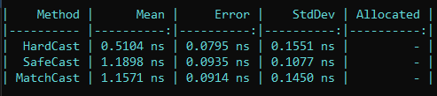
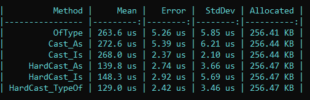

# CastTest

In this project I tried to replicate the different ways to cast an object in C#. 

For single object there are following:

### HardCast 
This is the most common way to cast an object, but it is only useful when the object is an instance of the type to be converted, i.e: 
``` 
public static object John = new Person();  
``` 
then we can do a hard cast
```
Person person = (Person)StaticObjects.John;
```
but if we have an anonymous object we have an exception.
```
public static object John = new  
{
    Id = Guid.NewGuid(),
    FullName = "John Doe"
};
```

### SafeCast
In this case, doesn't matter if we have an anonymous object, but the result should be nullable.
```
Person? person = StaticObjects.John as Person;
```

### MatchCast
In this case, as the last one, doesn't matter if we have an anonymous object, the main difference is that we have a condition when we are getting the object casting.
```
if (StaticObjects.John is Person person)
{
	return person;
}
```


For collection of objects there are following:

### OfType
```
StaticObjects.People
	.OfType<Person>()
	.ToList();
```
### Cast_As
```
StaticObjects.People
	.Where(p => p as Person is not null)
	.Cast<Person>()
	.ToList();
```
### Cast_Is
```
StaticObjects.People
	.Where(p => p is Person)
	.Cast<Person>()
	.ToList();
```
### HardCast_As
```
StaticObjects.People
	.Where(p => p as Person is not null)
	.Select(p => (Person)p)
	.ToList();
```
### HardCast_Is
```
StaticObjects.People
	.Where(p => p is Person)
	.Select(p => (Person)p)
	.ToList();
```
### HardCast_TypeOf
```
StaticObjects.People
	.Where(p => p .GetType() == typeof(Person))
	.Select(p => (Person)p)
	.ToList();
```



## Wrapping up
- The best way to cast an object is through SafeCast or MatchCast, as they are interchangeable. 
- The best option for collection of object is through OfType, since it's simple and readable.